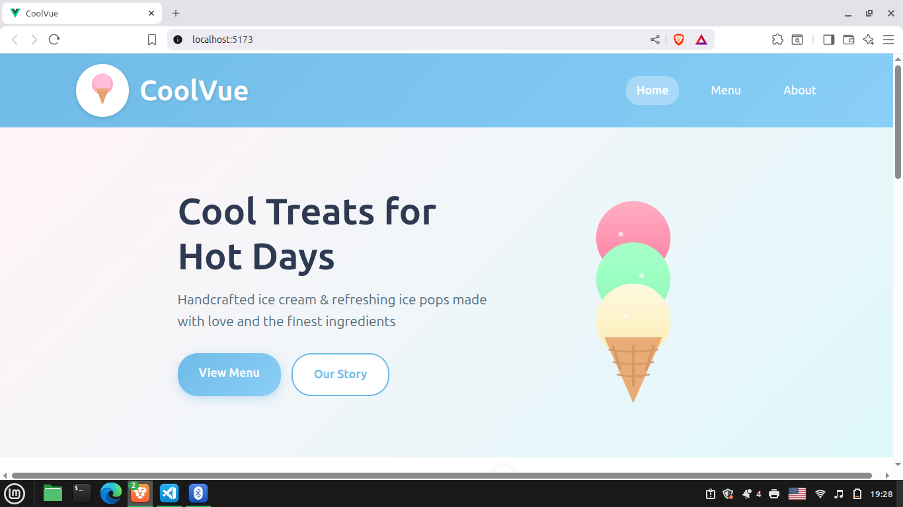
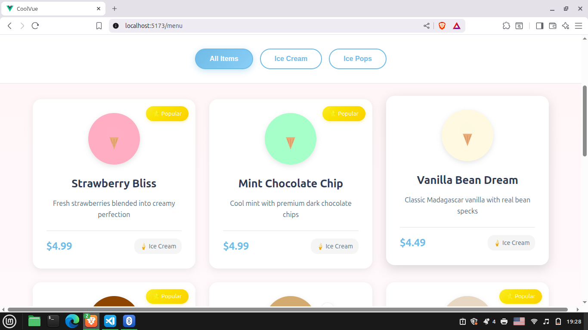

# CoolVue

CoolVue is a single-page application (SPA) for an ice cream business, built with Vue 3. It includes Home, Menu, and About pages, and uses Vue Router for smooth navigation.

## Features

- Responsive layout for desktop and mobile
- Built with reusable Vue components
- Powered by Vite for fast development
- Client side routing with Vue Router

## Tech Stack

- Frontend: Vue 3 + Vite
- Routing: Vue Router

## Installation

1. Clone the repository:

```bash
https://github.com/hquezada24/CoolVue.git
cd CoolVue
```

1. Install dependencies:

```bash
npm install
```

1. Start the development server:

```bash
npm run start
```

1. Open in your browser: [http://localhost:5473](http://localhost:5473)

## Screenshots

### Home



### Menu



### About


## Contact

Created by [Hugo Quezada](https://github.com/hquezada24)
